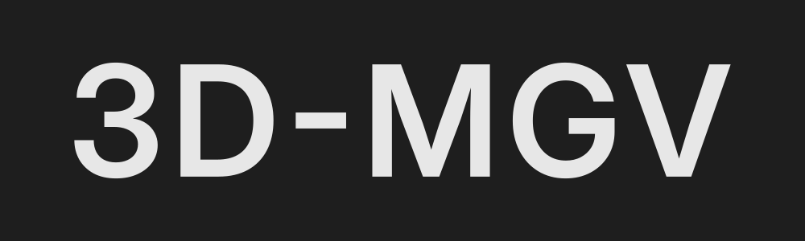
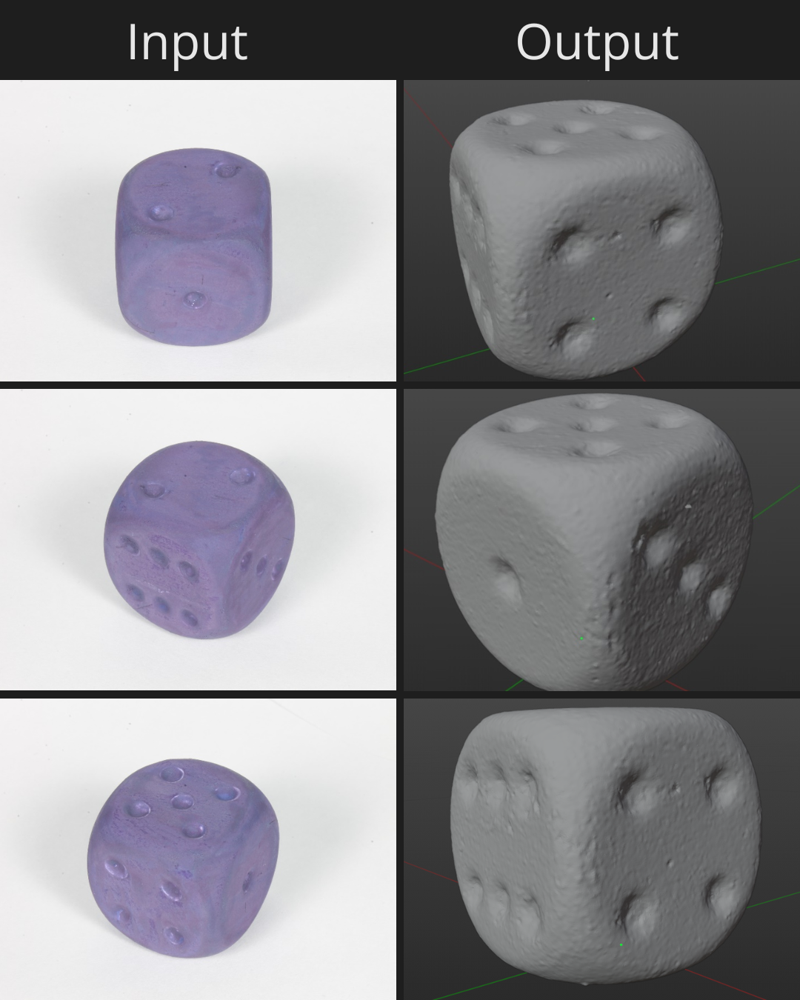
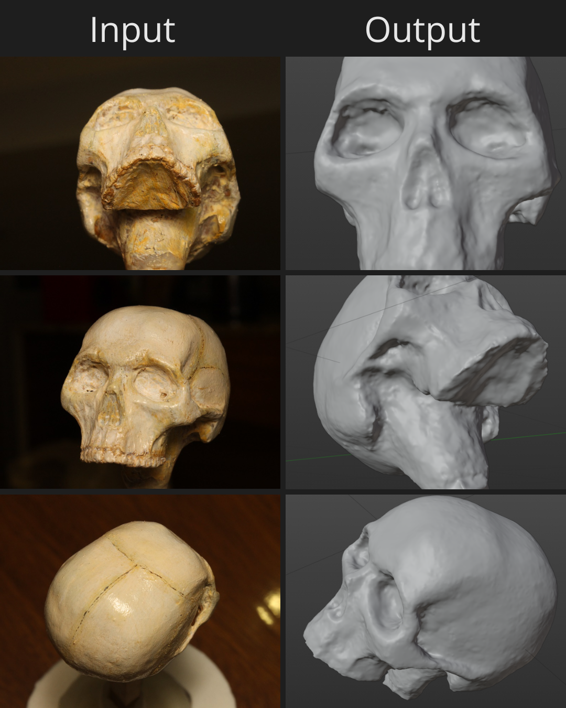

# 3DMGV

A Linux-first toolchain to convert videos into textured 3D models using OpenMVG, OpenMVS, and Python automation scripts.

## What it is

3DMGV automates a video-to-3D workflow:

- Extract frames from a video
- (Optional) remove background from frames
- Run Structure-from-Motion (OpenMVG) to estimate cameras + sparse point cloud
- Run Multi-View Stereo (OpenMVS) to densify, reconstruct mesh, and texture

The repository includes:

- A Python runner (`main.py`) that orchestrates the full pipeline
- Utility scripts under `utils/`
- OpenMVG and OpenMVS binaries bundled in `openMVG/` and `openMVS/`

## Current features

- End-to-end pipeline runner (`main.py`)
- Frame extraction via OpenCV (`utils/FrameExtraction.py`)
- Background removal via `rembg` (`utils/RemoveBackground.py`)
- OpenMVG feature computation, matching, geometric filtering, incremental SfM
- OpenMVS densification, mesh reconstruction, and texturing

## Planned features

- Improve robustness for low-quality / variable frame-rate videos
- Make background removal optional in `main.py`
- Add parameter presets and clearer “quality vs speed” toggles
- Better cleanup and output organization

## Technologies

- Python 3
- OpenCV, `rembg`, `colorama`
- OpenMVG (SfM)
- OpenMVS (MVS / mesh / textures)

## Screenshots


Console pipeline output


Warehouse sample


Dice sample


Skull sample

## Build

### Prerequisites

- Linux (or WSL)
- Python 3 + `pip`
- OpenMVG and OpenMVS binaries available under `openMVG/` and `openMVS/`

### System dependencies (Linux)

If you hit build/runtime errors on Linux, these are commonly required:

```bash
sudo apt update && sudo apt install -y \
	build-essential cmake git \ \
	figlet lolcat \ \
	libgl1 libglu1-mesa-dev \ \
	libpng-dev libjpeg-dev libtiff-dev \ \
	libboost-iostreams-dev libboost-program-options-dev libboost-system-dev libboost-serialization-dev \ \
	libopencv-dev \ \
	libcgal-dev libcgal-qt5-dev \ \
	libxxf86vm1 libxxf86vm-dev libxi-dev libxrandr-dev
```

### Python dependencies

```bash
python3 -m pip install --user colorama rembg opencv-python
```

If you see `libceres.so` errors, ensure OpenMVS and its dependencies are built and on your `LD_LIBRARY_PATH`.

## Run

### 1) Run the full pipeline (recommended)

Run from the repo root:

```bash
python3 main.py
```

It will prompt for the input video path, then write outputs into an `output/` folder next to your video (frames, SfM, MVS results).

### 2) Run steps manually (advanced)

Extract frames:

```bash
python3 utils/FrameExtraction.py path/to/video.mp4 output/frames
```

Remove background (optional):

```bash
python3 utils/RemoveBackground.py output/frames output/transparent
```

Then run the OpenMVG and OpenMVS binaries under `openMVG/bin/` and `openMVS/` (see `main.py` for the exact command sequence used).

## Configuration

Key paths and parameters are configured near the top of `main.py` (OpenMVG/OpenMVS paths, sensor DB, focal length).

## Project layout

- `openMVG/` — OpenMVG binaries and helpers
- `openMVS/` — OpenMVS tools
- `utils/FrameExtraction.py` — video -> frames
- `utils/RemoveBackground.py` — optional background removal helper
- `features.md` — design and feature overview

## Contributing

PRs and issues are welcome. If you’re adding a new pipeline step or changing reconstruction parameters, please also:

- Document the expected inputs/outputs (folders and file names)
- Update `main.py` (or add a new runner) to keep the end-to-end workflow working
- Add a short note in this README if setup steps change

## TODO

### Core

- [ ] Make background removal optional (skip `rembg` step)
- [ ] Better defaults for low-quality videos (denoise, stabilization, frame sampling)
- [ ] Improve output folder naming and cleanup

### Reconstruction

- [ ] Provide “known good” parameter presets (fast / balanced / quality)
- [ ] Improve matching robustness for fewer features / motion blur
- [ ] Tune OpenMVS densification and meshing to reduce artifacts
- [ ] Improve texture quality (seams, resolution, exposure consistency)

### Documentation

- [ ] Expand usage examples and troubleshooting
- [ ] Add a small sample dataset + expected output screenshots

For issues or help, open an issue in the repo.
